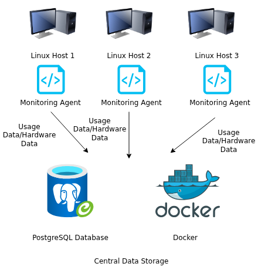

# Linux Cluster Monitoring Agent

## Introduction

The Linux Cluster Monitoring Agent is a small but practical monitoring solution built to track both system hardware details and live resource usage from Linux servers. The goal of this project is to give Linux Cluster Administration (LCA) teams a clear picture of how their servers are performing and how resources are being used over time, which helps with capacity planning and operational decisions.

The project uses Bash scripts to collect system information such as CPU configuration, memory availability, disk usage, and runtime performance metrics. All collected data is stored in a PostgreSQL database running inside a Docker container. Hardware information is collected once during setup, while usage data is recorded continuously at fixed intervals using cron.

This project focuses on real-world Linux administration concepts, including Bash scripting, Docker-based database provisioning, PostgreSQL interaction, and GitFlow-based version control, packaged together as a simple but functional monitoring agent.

---

## Quick Start

```bash
# 1. Start PostgreSQL using Docker
./scripts/psql_docker.sh create postgres password
./scripts/psql_docker.sh start

# 2. Create database tables
psql -h localhost -U postgres -d host_agent -f sql/ddl.sql

# 3. Insert hardware specifications (run once per host)
./scripts/host_info.sh localhost 5432 host_agent postgres password

# 4. Insert resource usage data (manual run)
./scripts/host_usage.sh localhost 5432 host_agent postgres password

# 5. Schedule host usage collection every minute
crontab -e
```

Example cron entry:

```cron
* * * * * /bin/bash /home/rocky/dev/jarvis_data_eng_PranshuPatel/linux_sql/scripts/host_usage.sh localhost 5432 host_agent postgres password >> /tmp/host_usage.log 2>&1
```

---

## Implementation

### Architecture

The system follows a simple agent-based design. Each Linux server runs a lightweight monitoring agent responsible for collecting system metrics. These metrics are sent to a centralized PostgreSQL database, which runs inside a Docker container. This approach keeps the setup portable, isolated, and easy to reproduce across environments.

**Key components of the system:**

* Linux servers running monitoring agents
* Bash scripts for data collection
* A PostgreSQL database hosted in Docker
* Cron jobs for automated metric collection

**Architecture Diagram:**
The architecture diagram (created using draw.io) illustrates three Linux hosts, each running a monitoring agent, sending data to a centralized PostgreSQL database. The image is stored in the `assets/` directory and referenced in this README.


---

### Scripts

#### `psql_docker.sh`

This script manages the PostgreSQL Docker container and handles database startup and shutdown.

```bash
./scripts/psql_docker.sh create <db_user> <db_password>
./scripts/psql_docker.sh start
./scripts/psql_docker.sh stop
```

Main responsibilities:

* Ensures Docker is running
* Creates the PostgreSQL container and persistent volume
* Starts and stops the database container as needed

---

#### `host_info.sh`

This script collects static hardware information from the host and stores it in the database. Since hardware details rarely change, it is intended to be executed only once per server.

```bash
./scripts/host_info.sh psql_host psql_port db_name psql_user psql_password
```

Collected information includes:

* Fully qualified hostname
* CPU configuration and model
* Total system memory
* Collection timestamp in UTC

---

#### `host_usage.sh`

This script captures real-time system usage metrics and inserts them into the database. It is designed to run automatically every minute using cron.

```bash
./scripts/host_usage.sh psql_host psql_port db_name psql_user psql_password
```

Collected metrics include:

* Available memory
* CPU idle and kernel usage percentages
* Disk I/O activity
* Available disk space
* Collection timestamp in UTC

---

#### `crontab`

Cron is used to automate the execution of the usage monitoring script. This ensures that system metrics are collected continuously without manual intervention.

---

#### `queries.sql`

This file contains SQL queries used to analyze the collected monitoring data. These queries help answer practical questions such as:

* How CPU or memory usage changes over time
* Disk space availability trends
* Resource usage patterns across different hosts

The results support informed decisions about scaling and infrastructure planning.

---

## Database Modeling

### `host_info` Table

| Column Name      | Description                     |
| ---------------- | ------------------------------- |
| id               | Unique identifier for each host |
| hostname         | Fully qualified hostname        |
| cpu_number       | Number of CPU cores             |
| cpu_architecture | CPU architecture type           |
| cpu_model        | CPU model name                  |
| cpu_mhz          | CPU clock speed                 |
| l2_cache         | L2 cache size (KB)              |
| total_mem        | Total system memory (KB)        |
| timestamp        | Data collection time (UTC)      |

---

### `host_usage` Table

| Column Name    | Description                 |
| -------------- | --------------------------- |
| timestamp      | Data collection time (UTC)  |
| host_id        | Reference to `host_info.id` |
| memory_free    | Free memory (MB)            |
| cpu_idle       | CPU idle percentage         |
| cpu_kernel     | CPU kernel usage percentage |
| disk_io        | Ongoing disk I/O operations |
| disk_available | Available disk space (MB)   |

---

## Test

Testing was performed manually throughout development:

* Verified PostgreSQL container startup and connectivity using `psql`
* Executed `ddl.sql` to confirm table creation
* Inserted test data and validated table constraints
* Ran monitoring scripts and confirmed records were inserted correctly
* Verified cron execution by checking logs and increasing row counts in the database

All components worked as expected without runtime errors.

---

## Deployment

The project is deployed using the following tools and practices:

* **GitHub** for version control and collaboration
* **Docker** to ensure consistent database deployment
* **Cron** to automate continuous data collection

The monitoring agent can be installed on any Linux system with Docker and Bash support.

---

## Improvements

Potential future improvements include:

1. Automatically detecting and handling hardware configuration changes
2. Adding alerting for abnormal resource usage
3. Supporting external or cloud-managed database services
4. Improving error handling and retry mechanisms for database failures

