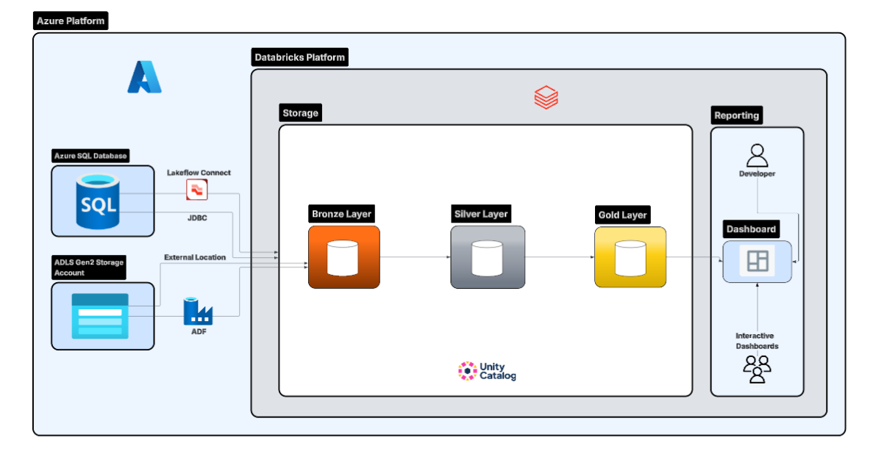
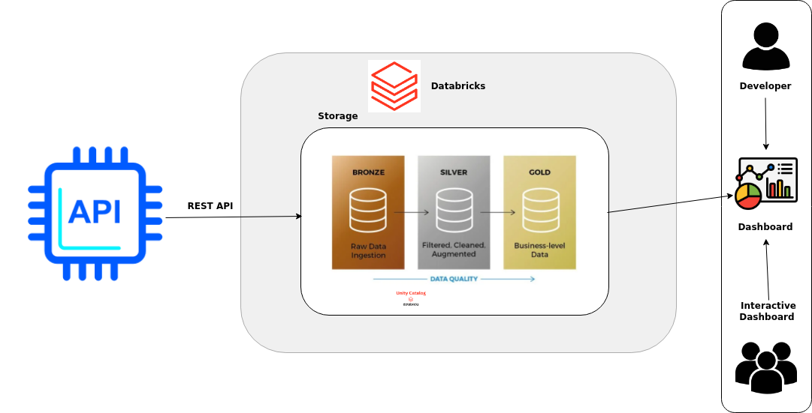

# Retail Data Analytics with PySpark

## Introduction

This project focuses on implementing data analytics workflows using PySpark in different notebook environments, including Databricks, Zeppelin, and Azure Databricks. The main goal was to strengthen practical experience with distributed data processing, structured DataFrame APIs, notebook-based analytics, cloud ETL design, medallion architecture, dashboard-driven reporting, and workflow orchestration.

In the Databricks portion of the project, I worked on retail transaction analytics using a PostgreSQL retail dataset. I loaded the data into Databricks with JDBC and used PySpark DataFrames to clean, transform, and analyze the data. The work included monthly sales analysis, placed versus canceled orders, active users, new versus existing users, and RFM customer segmentation.

In the Zeppelin portion of the project, I evaluated PySpark on Zeppelin notebook using the World Development Indicators dataset stored as a Hive table. This part of the project focused on understanding how PySpark works in Zeppelin and how analytical workflows can be developed using Spark SQL and PySpark DataFrames in a notebook environment.

In the Azure Databricks portion of the project, I built an end-to-end ETL and analytics pipeline for financial fraud analysis using Azure SQL Database, Azure Data Lake Storage Gen2, PySpark, Databricks dashboards, and job orchestration. This implementation followed the medallion architecture pattern and included bronze, silver, and gold layers for fraud-focused reporting.

In another Databricks implementation, I built a stock market analytics pipeline using Alpha Vantage API, PySpark, Delta tables, Databricks dashboards, and Databricks Jobs. This project focused on extracting stock data for multiple companies, applying medallion architecture, performing trend analysis on price and volume, and automating the workflow with job orchestration.

Technologies used in this project include PySpark, Databricks, Zeppelin, PostgreSQL, JDBC, GCP Dataproc, Hive Metastore, Azure SQL Database, Azure Data Lake Storage Gen2, Azure Data Factory, Databricks Jobs, Delta tables, REST API integration, and structured DataFrame APIs.

---

## Databricks Implementation

The Databricks implementation uses a retail transaction dataset stored in PostgreSQL. The dataset includes invoice number, stock code, item description, quantity, invoice date, unit price, customer ID, and country. I connected Databricks to PostgreSQL using JDBC and loaded the retail table into a PySpark DataFrame.

After loading the data, I performed analytics and wrangling tasks including:

- schema validation and data inspection
- calculation of sales amount
- monthly placed orders versus canceled orders
- monthly sales analysis
- monthly sales growth analysis
- monthly active users
- monthly new versus existing users
- RFM calculation
- RFM segmentation and segment summary analysis

The notebook implementation can be found here:

- [Retail Data Analytics with PySpark Notebook](./spark/notebook/Retail_Data_Analytics_with_PySpark.ipynb)

In this architecture, PostgreSQL acts as the source system, Databricks provides the notebook and compute environment, and PySpark DataFrames are used for transformation and aggregation. Databricks makes it easy to process the data at scale and interactively inspect intermediate and final results.

Main Databricks architecture components:

- PostgreSQL as the source database
- JDBC for data ingestion
- Databricks notebook as the analytics workspace
- PySpark DataFrames for distributed transformation and analysis
- Databricks runtime environment

### Databricks Architecture Diagram

---

## Zeppelin Implementation

The Zeppelin implementation focuses on evaluating PySpark on Zeppelin notebook using the World Development Indicators dataset. The purpose of this part was not retail analytics, but to understand how PySpark can be used effectively in Zeppelin for structured analytical tasks.

As a Data Engineer, I wanted to evaluate PySpark on Zeppelin notebook and understand how it works with Hive tables and notebook-based analytics. For this work, I reused the `wdi_csv_parquet` Hive table created from the WDI dataset. The dataset contains fields such as year, country name, country code, indicator name, indicator code, and indicator value.

Using Zeppelin and PySpark, I performed DataFrame-based analysis on the WDI dataset and strengthened my understanding of Spark transformations, filtering, aggregation, joins, and notebook-driven data exploration. This implementation also helped me compare the Zeppelin workflow with the Databricks workflow and understand the strengths of both notebook platforms.

The notebook implementation can be found here:

- [Spark Dataframe - WDI Data Analytics Notebook](./spark/notebook/Spark_Dataframe_WDI_Data_Analytics.ipynb)

In this architecture, the WDI dataset is stored as a Hive table and queried through Zeppelin using PySpark. Zeppelin acts as the interactive notebook interface, while PySpark provides the structured API used for analysis. This setup demonstrates how Spark-based analytics can be performed in Zeppelin using notebook-driven workflows.

Main Zeppelin architecture components:

- GCP Dataproc cluster
- Zeppelin notebook for interactive analytics
- Hive table for structured data access
- PySpark DataFrames for transformation and querying

### Zeppelin Architecture Diagram

---

## Financial Fraud Analytics ETL Pipeline on Azure Databricks

This project focuses on building an end-to-end ETL and analytics pipeline for financial fraud analysis using Azure services and Databricks. The dataset includes transaction data, card details, user information, merchant category codes, and fraud labels. The main goal of this implementation was to gain practical experience in cloud-based data engineering, multi-source ingestion, medallion architecture, dashboard development, and workflow orchestration.

The ingestion layer was designed using multiple Azure services. `transactions_data.csv` and `cards_data.csv` were first loaded into Azure SQL Database and then ingested into Databricks using JDBC. `users_data.csv`, `mcc_codes.json`, and `train_fraud_labels.json` were uploaded to Azure Data Lake Storage Gen2 and read into Databricks from cloud storage.

After ingestion, the project was structured using the medallion architecture:

### Bronze Layer

The bronze layer stores raw ingested data with minimal transformation. It acts as the landing zone for all source entities.

Bronze tables created in this project:

- `bronze.transactions_bronze`
- `bronze.cards_bronze`
- `bronze.users_bronze`
- `bronze.mcc_codes_bronze`
- `bronze.fraud_labels_bronze`

### Silver Layer

The silver layer focuses on cleaning, structuring, and enriching the bronze data. In this stage, I standardized schema, converted data types, reshaped reference data, and enhanced transactions with fraud and merchant category information.

Silver tables created in this project:

- `silver.cards_silver`
- `silver.users_silver`
- `silver.transactions_silver`

Key transformations included:

- cleaning card and user attributes
- converting income and debt columns into numeric values
- converting MCC reference data into a lookup format
- joining fraud labels with transaction data
- enriching transactions with merchant category descriptions
- creating analytical features such as transaction date, day of week, hour of day, time of day, week start, year-month, and high-value transaction flags

### Gold Layer

The gold layer was created for business analytics and dashboard reporting. These tables were designed to answer fraud-focused analytical questions and act as the curated source for dashboard visualizations.

Gold tables created in this project:

- `gold.fraud_by_day_of_week`
- `gold.fraud_rate_daily`
- `gold.top_users_by_fraud_count`
- `gold.user_spike_vs_weekly_avg`
- `gold.fraud_rate_by_mcc`
- `gold.high_fraud_merchants`
- `gold.fraud_by_time_of_day`
- `gold.avg_amount_fraud_vs_nonfraud`
- `gold.fraud_amount_by_mcc`
- `gold.daily_fraud_losses`
- `gold.unique_fraud_users_weekly`
- `gold.monthly_fraud_spikes`
- `gold.user_behavior_before_after_fraud`
- `gold.high_value_vs_low_value_fraud`

These gold outputs were used to answer questions such as:

- which days of the week show the most fraudulent transactions
- how fraud rate changes over time
- which users have the highest number of flagged transactions
- which merchant categories and merchants show elevated fraud activity
- how fraud varies across time of day
- whether fraud is more common in high-value purchases
- how user behavior changes before and after a fraudulent event

### Dashboard and Job Orchestration

A Databricks dashboard was built using the gold tables as the analytical source layer. The dashboard includes fraud-focused visuals such as fraud by day of week, fraud rate trends, top users by fraud count, fraud by merchant category, fraud by time of day, daily fraud losses, monthly fraud spikes, and high-value versus low-value fraud analysis. Filter widgets were also added to improve interactivity.

To operationalize the workflow, a Databricks job pipeline was created with task dependencies in the following order:

- Bronze Notebook
- Silver Notebook
- Gold Notebook
- Dashboard Refresh

This made the full workflow reproducible and easier to refresh in a structured sequence.

### Azure ETL Architecture Diagram

---

## Stock Market Analytics Pipeline on Databricks

This project focuses on building an end-to-end stock market analytics pipeline using Alpha Vantage API, PySpark, Databricks DLT, Delta tables, dashboards, and workflow orchestration. The main goal of this implementation was to gain practical experience in API-based ingestion, medallion architecture design, financial time-series transformation, data quality validation, trend analysis, and automated pipeline execution in Databricks.

The pipeline was built for four companies:

- Apple (`AAPL`)
- Microsoft (`MSFT`)
- Google (`GOOGL`)
- Tesla (`TSLA`)

The source data was extracted from the Alpha Vantage API using three endpoints:

- `TIME_SERIES_DAILY` for historical daily stock prices and volume
- `GLOBAL_QUOTE` for latest ticker snapshot data
- `OVERVIEW` for company-level metadata

To keep the API key secure, it was stored in Databricks Secrets and accessed inside the ingestion notebook during execution. Because the source is a rate-limited external API, the workflow was divided into two logical parts:

1. a raw ingestion notebook that lands source data into Delta tables
2. a Databricks DLT pipeline that transforms the data through bronze, silver, and gold layers

This design made the ingestion step more controllable while still using DLT for the medallion transformation pipeline.

### Raw Ingestion Layer

A separate ingestion notebook was created to call the Alpha Vantage API for all four symbols and land the source data into raw Delta tables in append mode.

Raw tables created in this project:

- `raw_stock.alpha_daily_raw`
- `raw_stock.alpha_quote_raw`
- `raw_stock.alpha_company_raw`

The raw landing layer preserves source history over time and acts as the upstream input for the DLT pipeline.

### Bronze Layer

The bronze layer was implemented in a dedicated DLT transformation file and acts as the first pipeline-managed layer. It reads the raw landing tables and splits the data into separate company-level DLT tables.

Bronze tables created in this project:

#### Daily stock history
- `bronze_aapl_daily`
- `bronze_msft_daily`
- `bronze_googl_daily`
- `bronze_tsla_daily`

#### Latest quote tables
- `bronze_aapl_quote`
- `bronze_msft_quote`
- `bronze_googl_quote`
- `bronze_tsla_quote`

#### Company overview tables
- `bronze_aapl_company`
- `bronze_msft_company`
- `bronze_googl_company`
- `bronze_tsla_company`

This layer preserves the raw structure while organizing the API data into separate company-specific datasets required by the project.

### Silver Layer

The silver layer was implemented in a separate DLT transformation file and focuses on cleaning, standardizing, validating, and deduplicating the daily stock data for each company.

Silver tables created in this project:

- `silver_aapl`
- `silver_msft`
- `silver_googl`
- `silver_tsla`

Key transformations included:

- explicit type casting for all important fields
- null validation on required columns
- business rule validation such as:
  - `high_price >= low_price`
  - `open_price >= low_price`
  - `open_price <= high_price`
  - `close_price >= low_price`
  - `close_price <= high_price`
  - `volume >= 0`
- deduplication using `symbol` and `trading_date`, keeping the latest record based on `api_pull_ts`
- final selection of consistent analytical columns for downstream reporting

The silver layer used DLT expectations and transformation logic to ensure that only valid and reliable stock records were propagated forward.

### Gold Layer

The gold layer was implemented in a separate DLT transformation file and was designed for analytical reporting and dashboard consumption.

Gold tables created in this project:

- `gold_stock_history`
- `gold_price_trend`
- `gold_volume_trend`

#### `gold_stock_history`

This table combines the cleaned silver data of all four companies into one curated stock history dataset. It acts as the common business-ready analytical base for downstream calculations and dashboarding.

#### `gold_price_trend`

This table performs price trend analysis for each company using window functions partitioned by `symbol` and ordered by `trading_date`. It includes:

- close price from 7 trading days ago
- close price from 30 trading days ago
- close price from 90 trading days ago
- 7-day absolute price change
- 30-day absolute price change
- 90-day absolute price change
- 7-day percentage price change
- 30-day percentage price change
- 90-day percentage price change

#### `gold_volume_trend`

This table performs volume trend analysis for each company using the same company-partitioned window logic. It includes:

- volume from 7 trading days ago
- volume from 30 trading days ago
- volume from 90 trading days ago
- 7-day absolute volume change
- 30-day absolute volume change
- 90-day absolute volume change

These gold outputs were designed to answer questions such as:

- how the stock price of each company has changed over 7, 30, and 90 trading days
- which companies show stronger short-term or medium-term price momentum
- how trading volume has shifted over time for each company
- how multiple companies compare side by side in terms of price and volume trends

### DLT Pipeline Structure

To make the pipeline cleaner and easier to maintain, the Databricks DLT implementation was separated into different transformation files:

- `bronze_stock_dlt`
- `silver_stock_dlt`
- `gold_stock_dlt`

This structure made the medallion layers easier to understand, maintain, and present, while still running as part of the same DLT pipeline.

### Dashboard and Job Orchestration

A Databricks dashboard was built using the gold tables as the reporting layer. The dashboard includes visuals such as:

- close price trend over time
- trading volume trend over time
- 7-day, 30-day, and 90-day price change comparison
- 7-day, 30-day, and 90-day percentage price change comparison
- 7-day, 30-day, and 90-day volume change comparison

This made it possible to analyze both single-company trends and cross-company comparisons from the curated gold outputs.

To operationalize the workflow, a Databricks job was created with task dependencies in the following order:

- Raw Ingestion Notebook
- DLT Pipeline Update
- Dashboard Refresh

This orchestration design allowed the full workflow to run in a controlled sequence on a daily schedule. The raw ingestion notebook appended source data into Delta landing tables, the DLT pipeline refreshed bronze, silver, and gold transformations, and the dashboard task refreshed the final visual layer.

### Stock Market Pipeline Architecture Diagram

---

## Future Improvement

There are several ways this project can be improved in the future:

1. Add stronger automated data quality checks across bronze, silver, and gold layers, including schema validation, null checks, duplicate detection, and threshold-based anomaly rules for financial and transactional datasets.

2. Replace any remaining hardcoded configuration values with fully parameterized notebooks and environment-aware configuration so the same pipelines can run more easily across development, testing, and production environments.

3. Expand the stock market analytics project by adding company overview data, latest quote data, and additional market indicators such as moving averages, rolling volatility, and comparative performance benchmarks.

4. Extend the fraud analytics pipeline with more advanced fraud features and machine learning-ready feature engineering for downstream predictive modeling.

5. Add more interactive business dashboards and drill-down views for retail analytics, fraud analytics, and stock market analytics use cases.

6. Improve orchestration further with production-style scheduling, monitoring, retry logic, failure handling, and alerting for Databricks workflows.

7. Enhance security further by standardizing secret management, role-based access, and secure connectivity patterns across API, database, and cloud storage integrations.

8. Expand the comparison between Databricks and Zeppelin with a more formal evaluation of usability, scalability, maintainability, and performance.

9. Improve the stock pipeline further by reducing repeated API loads through incremental logic or controlled ingestion strategies while preserving historical data quality.
