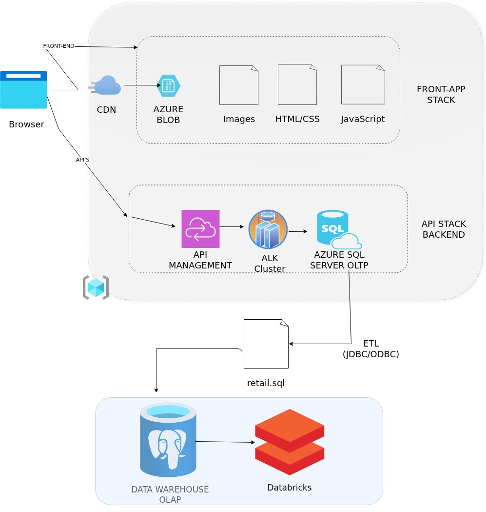
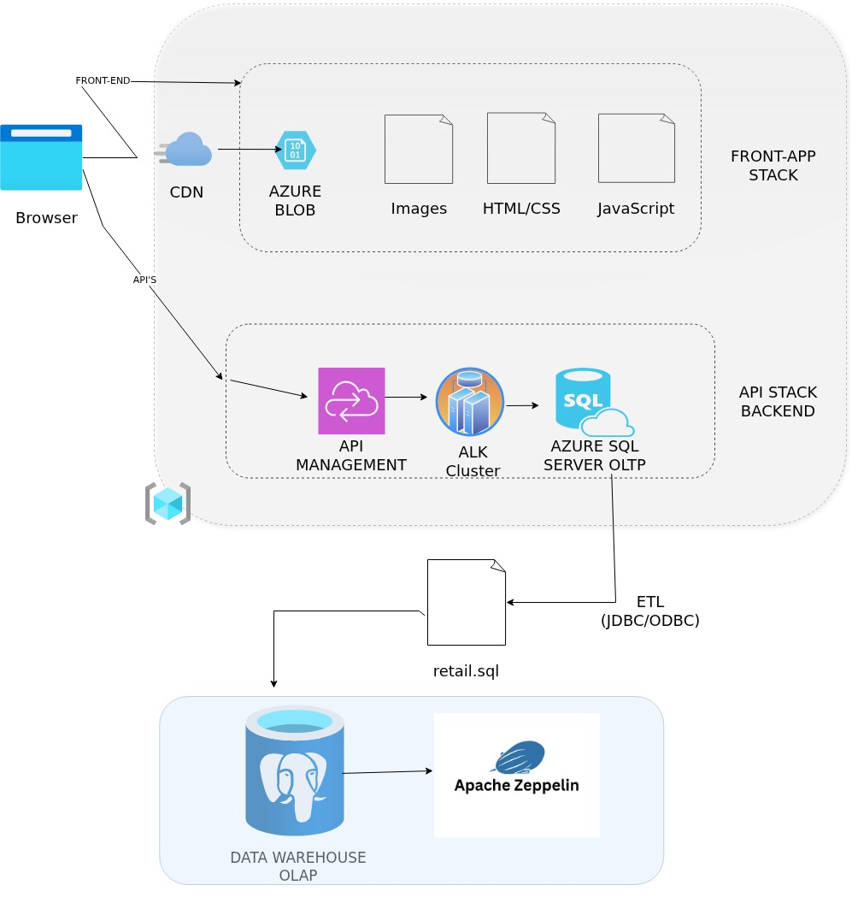

# Retail Data Analytics with PySpark

## Introduction

This project focuses on implementing data analytics workflows using PySpark in two different big data notebook environments: Databricks and Zeppelin. The overall goal was to strengthen practical experience with distributed data processing, structured APIs, and notebook-based analytics using PySpark.

In the Databricks portion of the project, I worked on retail transaction analytics using a PostgreSQL retail dataset. I loaded the data into Databricks with JDBC and used PySpark DataFrames to clean, transform, and analyze the data. The work included monthly sales analysis, placed versus canceled orders, active users, new versus existing users, and RFM customer segmentation.

In the Zeppelin portion of the project, I evaluated PySpark on Zeppelin notebook using the World Development Indicators dataset stored as a Hive table in a Hadoop environment. This part of the project focused on understanding how PySpark works in a Zeppelin + Hadoop + Hive ecosystem and how analytics workflows differ from Databricks. Together, both implementations helped me understand PySpark across multiple distributed platforms.

Technologies used in this project include PySpark, Databricks, Zeppelin, PostgreSQL, JDBC, GCP Dataproc, Hadoop, Hive Metastore, and structured DataFrame APIs.

---

## Databricks and Hadoop Implementation

The Databricks implementation uses a retail transaction dataset stored in PostgreSQL. The dataset includes invoice number, stock code, item description, quantity, invoice date, unit price, customer ID, and country. I connected Databricks to PostgreSQL using JDBC and loaded the retail table into a PySpark DataFrame.

After loading the data, I performed analytics and wrangling tasks including:

- schema validation and data inspection
- calculation of sales amount
- monthly placed orders versus canceled orders
- monthly sales analysis
- monthly sales growth analysis
- monthly active users
- monthly new versus existing users
- RFM calculation
- RFM segmentation and segment summary analysis

The notebook implementation can be found here:

- [Retail Data Analytics with PySpark Notebook](./spark/notebook/Retail_Data_Analytics_with_PySpark.ipynb)

In this architecture, PostgreSQL acts as the source system, Databricks provides the notebook and compute environment, and PySpark DataFrames are used for transformation and aggregation. Databricks allows scalable distributed analysis while also making it easy to inspect intermediate and final DataFrames interactively.

Main Databricks architecture components:

- PostgreSQL as the source database
- JDBC for data ingestion
- Databricks notebook as the analytics workspace
- PySpark DataFrames for distributed transformation and analysis
- Databricks runtime and storage layer
- metadata support for notebook-based analytics

### Databricks Architecture Diagram

---

## Zeppelin and Hadoop Implementation

The Zeppelin implementation focuses on evaluating PySpark on Zeppelin notebook using the World Development Indicators dataset. The business goal of this part was not retail analytics, but rather to explore how PySpark can be used in Zeppelin for structured analytical tasks in a Hadoop environment.

As a Data Engineer, I wanted to evaluate PySpark on Zeppelin notebook and understand how it works with Hive tables and Hadoop-based storage. For this work, I reused the `wdi_csv_parquet` Hive table that was created in the Hadoop project. The dataset contains development indicator data such as year, country name, country code, indicator name, indicator code, and indicator value.

Using Zeppelin and PySpark, I performed DataFrame-based analysis on the WDI dataset and reinforced my understanding of Spark transformations, filtering, aggregation, joins, and notebook-driven data exploration. This implementation helped compare the Zeppelin workflow with the Databricks workflow and provided hands-on experience with a more traditional Hadoop ecosystem.

The notebook implementation can be found here:

- [Spark Dataframe - WDI Data Analytics Notebook](./spark/notebook/Spark_Dataframe_WDI_Data_Analytics.ipynb)

In this architecture, the parquet-based WDI dataset is stored in HDFS and exposed through a Hive external table. Zeppelin serves as the interactive notebook interface, while the Dataproc cluster provides the Hadoop and Spark execution environment. PySpark is used to query and analyze the Hive table through Spark DataFrame APIs.

Main Zeppelin and Hadoop architecture components:

- GCP Dataproc cluster
- Hadoop ecosystem for distributed storage and processing
- HDFS for parquet dataset storage
- Hive Metastore and Hive table for schema management
- Zeppelin notebook for interactive analytics
- PySpark DataFrames for transformation and querying

### Zeppelin Architecture Diagram

---

## Future Improvement

There are several ways this project can be improved in the future:

1. Add business dashboards on top of the Databricks retail analytics output so that monthly sales, user activity, and RFM insights can be monitored more easily.

2. Automate the retail data ingestion workflow from PostgreSQL into a scheduled analytics pipeline instead of using a manual notebook-driven process.

3. Improve the RFM segmentation logic by working with business stakeholders to define more accurate segment rules and action plans for each customer group.

4. Extend the Zeppelin implementation beyond exploratory WDI analysis by creating more advanced Spark transformations, joins, and reusable data pipelines.

5. Integrate cloud object storage and partitioned tables to make both Databricks and Zeppelin workflows more production-ready and scalable.

6. Compare performance, usability, and scalability between Databricks and Zeppelin more formally using the same analytical workload.
